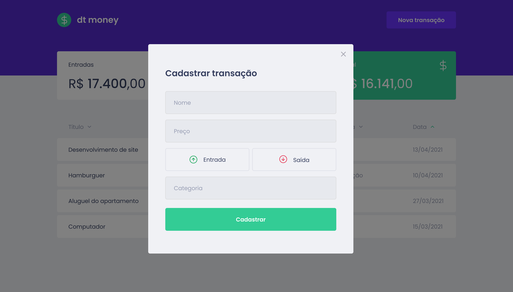

<p align="center">
   
</p>

<p align="center">
   <a href="https://www.linkedin.com/in/pablogiaccon/">
      
   </a>
  
  
  
  
  <a href="mailto:pablogiaccon@gmail.com">
   
  </a>
</p>

<p align="center">
  💰 Manage your money. Project developed during the second Bootcamp Ignite <a href="https://github.com/Rocketseat">@Rocketseat</a>
</p>

# 📌 Contents

* [Screenshots](#camera-screenshot)
* [Technologies](#rocket-technologies)
* [How to Run](#computer-how-to-run)
* [Issues](#bug-issues)
* [Contributing](#sparkles-issues)
* [License](#page_facing_up-license)

# 📸 Screenshots
<div align="center">
   
   
</div>

# 🚀 Technologies
This project was made using the follow technologies:

* [Typescript](https://www.typescriptlang.org/)
* [React](https://reactjs.org/)
* [Styled Components](https://styled-components.com/)
* [MirageJS](https://miragejs.com/)

# 💻 How to run

```bash
# Clone Repository
$ git clone https://github.com/pablogiaccon/dt-money-ignite.git
```

```bash
# Install Dependencies
$ yarn

# Run Aplication
$ yarn start
```
Go to http://localhost:3000/ to see the result.

# 🐞 Issues

Create a <a href="https://github.com/pablogiaccon/dt-money-ignite/issues">new issue report</a>, it will be an honor to be able to help you solve and further improve our application.

# ✨ Contributing

- Fork this repository;
- Create a branch with your feature: `git checkout -b my-feature`;
- Commit your changes: `git commit -m 'feat: My new feature'`;
- Push to your branch: `git push origin my-feature`.

# 📓 License

This project is under the [MIT license](./LICENSE).
Made by [Pablo Giaccon](https://www.linkedin.com/in/pablogiaccon/).

Cheers!
